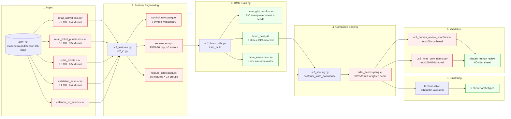
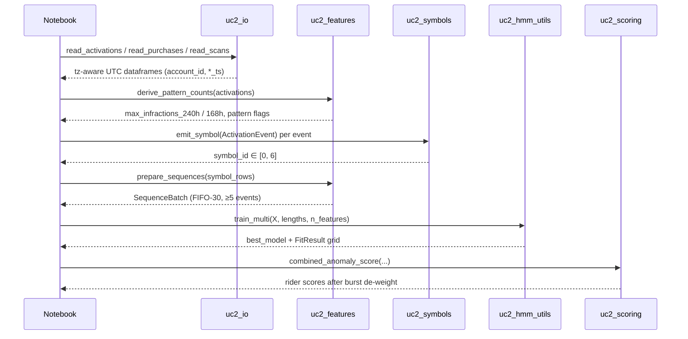

# Architecture

How a raw S3 event becomes a deployable risk score, in six stages.

## Pipeline overview

Boxes shaded red contain rider identifiers and are excluded from this repository (see [DATA.md](DATA.md) and [.gitignore](.gitignore)). Boxes shaded green contain only model-level artefacts and are committed.

## Module map (`UC2_v2/src/`)

| Module | Responsibility |
|---|---|
| [`uc2_symbols.py`](UC2_v2/src/uc2_symbols.py) | Seven-symbol activation vocabulary; first-match-wins emit rule on a per-event `ActivationEvent` record |
| [`uc2_features.py`](UC2_v2/src/uc2_features.py) | O(n) two-pointer pattern-window counter (HIGH 240 h / MEDIUM 168 h); FIFO-30 sequence prep; timing aggregates |
| [`uc2_hmm_utils.py`](UC2_v2/src/uc2_hmm_utils.py) | `train_multi` parallel multi-seed × multi-state grid; `hmmlearn` primary + pure-numpy Baum-Welch fallback; BIC selection |
| [`uc2_scoring.py`](UC2_v2/src/uc2_scoring.py) | Posterior-state dominance, four-signal weighted composite, burst-only de-weight |
| [`uc2_io.py`](UC2_v2/src/uc2_io.py) | Chunked CSV reads (1 M-row chunks), categorical ID dtypes, strict UTC timestamp validation, calendar enrichment |

## Data-flow contracts

## Notebook → output map

| # | Notebook | Reads | Writes |
|---|---|---|---|
| 01 | `01_UC2_Feature_Engineering.ipynb` | All input CSVs | `feature_table.parquet`, `symbol_rows.parquet`, `sequences.npz` |
| 02 | `02_UC2_HMM_Training.ipynb` | `sequences.npz` | `hmm_best.pkl`, `hmm_emissions.csv`, `hmm_grid_results.csv` |
| 03 | `03_UC2_Exercise3_Scoring.ipynb` | All of the above | `rider_scores.parquet`, `uc2_human_review_shortlist_v2.csv` |
| 04 | `04_UC2_Rule_Based_Validation.ipynb` | All of the above | `uc2_rule_vs_hmm_overlap.csv`, `uc2_hmm_only_riders.csv` |

## Key design decisions

- **Burst symbols at the aggregate level, not the symbol stream.** Repeat-offender behaviour is captured by `repeat_offender_flag` and `max_infractions_240h`; a dedicated observation symbol would double-count.
- **State grid `{7, 9, 11}` × 8 seeds = 24 fits.** Covers the likelihood landscape sufficiently to mitigate seed sensitivity while staying tractable on commodity hardware (≈ 90 min on a 16 GB M-series laptop at 2/3 of CPU cores).
- **Posterior-dominance threshold 0.3** for labelling a rider as posterior-driven on the shortlist — tuned to the top-100 cut.
- **Burst de-weight factor 0.25** — a 350-burst rider with only 2 fast events has their combined score reduced by ≈ 2.6 pre-normalisation, dropping them out of the top-100 while leaving hybrid riders intact.
- **Categorical IDs at the merge boundary.** pandas refuses to `merge_asof` two categorical columns whose category sets differ; we cast back to `object` only at the merge surface and keep large frames categorical for memory.

## Performance characteristics

| Stage | Wall-clock | Peak RSS |
|---|---|---|
| Notebook 01 — feature engineering | ~22 min | ~7 GB |
| Notebook 02 — HMM training (24 fits, parallel) | ~90 min | ~5 GB |
| Notebook 03 — scoring | ~3 min | ~3 GB |
| Notebook 04 — rule-vs-HMM validation | ~2 min | ~3 GB |

Reproducible on a 16 GB M-series laptop. See [UC2_v2/RUN_RESULTS.md](UC2_v2/RUN_RESULTS.md) for the full memory budget.
