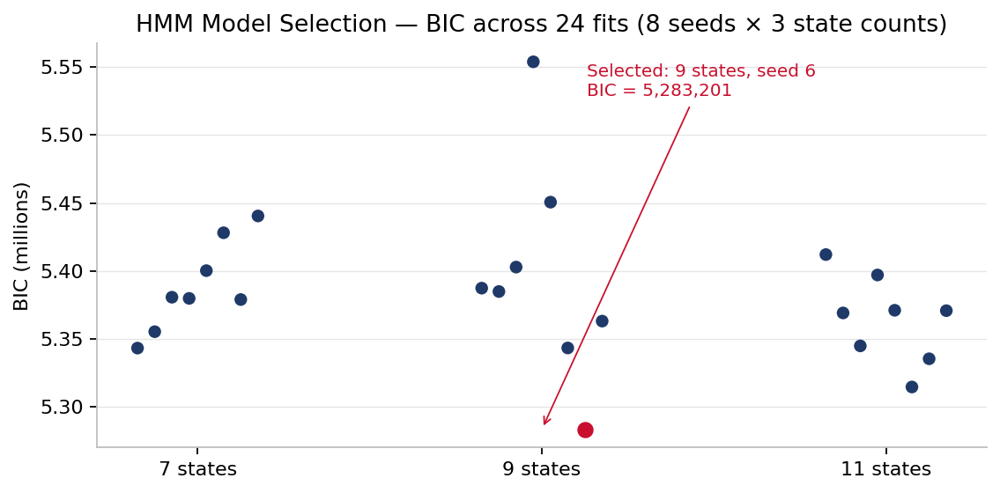
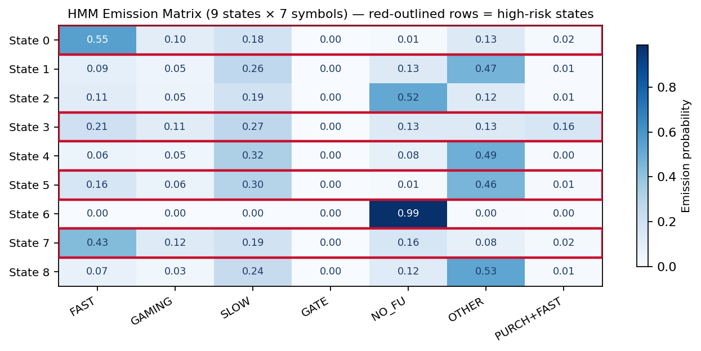
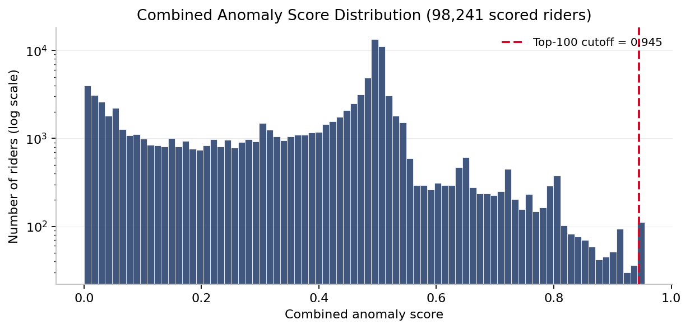
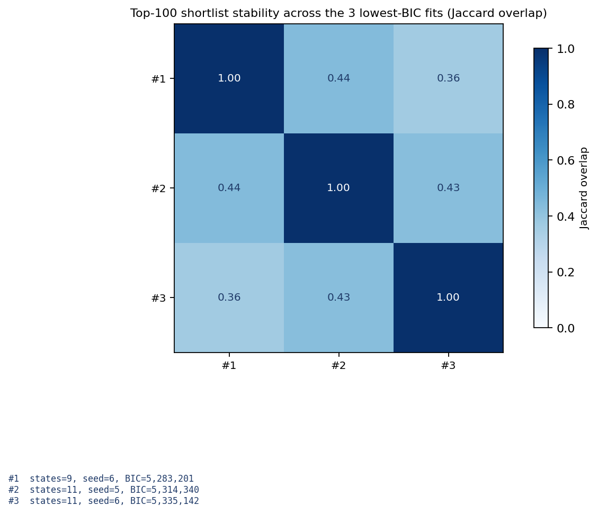

# Detecting Inspector-Triggered Ticket-Purchase Fraud on MBTA Commuter Rail

**A Hidden Markov Model and Multi-Signal Anomaly Scoring Framework for Behavioural Fare-Evasion Detection**

[](https://www.python.org/downloads/)
[](LICENSE)
[](Final%20Report.docx)
[](https://www.masabi.com)

> A four-layer ML pipeline (rule baseline + 9-state HMM + multi-signal anomaly score + K-means clustering) that surfaces **15,195 fare-evading riders** the existing rule-based system completely misses — a **20.5 % novelty rate** across **221,382 riders** and **2,904,144 activation–scan events** on the MBTA commuter rail network.

---

## Submission

| | |
|---|---|
| **Course** | BUS 596 — Capstone Project |
| **Programme** | MS FinTech |
| **Submitted to** | Professor Jim Ryan |
| **Date** | 1 May 2026 |
| **Industry partners** | Masabi × Gemsen |
| **Platform** | SymetryML · AWS S3 |

## Team — MS FinTech Team 2

- Daniel Duah
- Bismark Kofi Sarfo Owusu
- Sai Priya Malyala
- Martin Thulani Milanzi
- Sai Krishna Vaddeboina

---

## Deliverables in this folder

| File | Purpose |
|---|---|
| [Final Report.docx](Final%20Report.docx) | Full written report (executive summary, methodology, results, discussion, references, appendix) |
| [Final Presentation.pptx](Final%20Presentation.pptx) | Final defence slide deck |
| [Final Poster.pptx](Final%20Poster.pptx) | Conference-style summary poster |
| [UC2_v2/](UC2_v2/) | Reproducible Python implementation (notebooks, source modules, outputs) |

The written report is the canonical reference for methodology, results, and recommendations. The `UC2_v2/` folder contains the working code pipeline that produces the artefacts described in the report.

---

## Project at a glance

A four-layer machine-learning pipeline that identifies **15,195 fare-evading riders** on the MBTA commuter rail network whom Masabi's existing rule-based fraud-detection system completely misses — a **20.5 % novelty rate**, exceeding the 20 % threshold negotiated with the industry partner at project inception.

The pipeline is positioned as a *complement* to rule-based detection rather than a replacement: existing Pattern rule flags retain a 20 % weight in the composite anomaly score, ensuring continuity with established operational practice while opening three previously inaccessible detection dimensions.

### Headline numbers

| Metric | Value |
|---|---|
| Activation–scan events analysed | 2,904,144 |
| Unique riders profiled | 221,382 |
| MBTA commuter rail lines covered | 13 |
| Stations covered | 142 |
| Engineered features | 86 (across 14 feature groups) |
| HMM behavioural symbol vocabulary | 7 symbols |
| HMM states selected by BIC | **9** (from {2, 3, 4, 5, 7, 9, 11}) |
| Total Baum-Welch fits | 70 |
| Riders entering HMM training | 65,376 (50/50 stratified) |
| Composite-score signals | 4 (inspector 30 %, HMM 25 %, gaming 25 %, rules 20 %) |
| Operational clusters (K-means, K = 6) | 6, silhouette = 0.183 |
| **HMM-novel riders** (HMM flags, Pattern misses) | **15,195** |
| **Novelty rate** | **20.5 %** |

---

## The four research questions

| # | Question | Answer |
|---|---|---|
| RQ1 | Do riders systematically activate tickets only when an inspector is physically present, and can this be quantified? | **Yes.** The inspector-reactivity gap reaches its theoretical maximum of 1.0 across the top 20 most reactive riders. Cluster 5 (1,162 riders) is composed almost entirely of inspector-reactive activators with a Pattern flag rate of just 0.1 %. |
| RQ2 | Can sequence memory reveal habitual evasion that count-based rules cannot? | **Yes.** Three HMM states (S0, S1, S3) exhibit self-transition probabilities exceeding 0.97 — direct empirical evidence that fare evasion is *habitual*, not situational. |
| RQ3 | Are there riders whose activations cluster systematically in the 16–30 s gaming band, or whose purchase-to-scan sequences compress to seconds? | **Yes.** Threshold-zone activity sums to 277,886 events across three timing bands; PURCHASE_THEN_ACTIVATE_FAST captures ≈ 250,000 events and is the dominant emission of HMM State 0 (11,920 riders). |
| RQ4 | Can the suspicious population be partitioned into operationally distinct enforcement archetypes? | **Yes.** K-means at K = 6 (silhouette 0.183) yields six clusters with distinct enforcement implications, ranging from immediate action (Cluster 2) to false-positive investigation (Cluster 4). |

---

## The pipeline — four layers

```
┌──────────────────────┐  ┌──────────────────────┐  ┌──────────────────────┐  ┌──────────────────────┐
│ 1. RULE BASELINE     │  │ 2. 9-STATE HMM       │  │ 3. COMPOSITE SCORE   │  │ 4. K-MEANS K=6       │
│                      │  │                      │  │                      │  │                      │
│ Pattern Rule A & B   │  │ 7-symbol vocabulary  │  │ 30 % inspector       │  │ Six operational      │
│ flags 58,752 riders  │  │ BIC selects 9 states │  │ 25 % HMM posterior   │  │ archetypes from      │
│ (26.5 %) on the MBTA │  │ 3 evasion archetypes │  │ 25 % gaming          │  │ 61,869 selected      │
│ commuter rail        │  │ self-trans > 0.97    │  │ 20 % rule flags      │  │ riders               │
└──────────────────────┘  └──────────────────────┘  └──────────────────────┘  └──────────────────────┘
```

### The seven HMM symbols

| ID | Symbol | Definition |
|---|---|---|
| 0 | `ACTIVATE_FAST_HANDHELD` | Handheld scan, gap < 25 s |
| 1 | `ACTIVATE_GAMING_THRESHOLD` | Handheld, 25 ≤ gap ≤ 30 s |
| 2 | `ACTIVATE_SLOW_HANDHELD` | Handheld, 30 < gap ≤ 120 s |
| 3 | `ACTIVATE_VERY_SLOW_HANDHELD` | Handheld, gap > 120 s |
| 4 | `ACTIVATE_GATE` | Gate scan, any timing |
| 5 | `NORMAL_COMMUTE` | No scan or gap > 120 s |
| 6 | `PURCHASE_THEN_ACTIVATE_FAST` | Purchase + activation + scan compressed within 25 s |

### The three evasion archetypes (HMM states)

| State | Label | Riders | Dominant emission | Self-transition |
|---|---|---|---|---|
| **S1** | Habitual Evader | 20,075 (26.6 %) | `ACTIVATE_FAST_HANDHELD` (0.753) | **0.984** |
| **S0** | Purchase-Triggered | 11,920 (11.6 %) | `PURCHASE_THEN_ACTIVATE_FAST` (0.367) | **0.971** |
| **S3** | Moderate Evader | 20,099 (23.0 %) | `ACTIVATE_FAST_HANDHELD` (0.463) | **0.973** |

### Selected figures

<p align="center">
  
  &nbsp;
  
</p>
<p align="center">
  <em>Left:</em> BIC across the state grid — 9 states minimise BIC.
  &nbsp;&nbsp;
  <em>Right:</em> emission probabilities for the selected 9-state HMM.
</p>

<p align="center">
  
  &nbsp;
  
</p>
<p align="center">
  <em>Left:</em> distribution of combined anomaly scores.
  &nbsp;&nbsp;
  <em>Right:</em> top-100 shortlist stability across HMM seeds.
</p>

### The six operational clusters (K-means)

| Cluster | Label | Riders | Score | Rule A | Recommended action |
|---|---|---|---|---|---|
| **C2** | Confirmed Evader | 10,122 | 0.585 | 100 % | **IMMEDIATE ACTION** |
| **C3** | Large Evader Pool | 22,199 | 0.534 | 97.6 % | Prioritise review |
| **C0** | Rule-Flagged Moderate | 7,136 | 0.416 | 58.9 % | Peak-hour enforcement |
| **C1** | HMM-Novel Anomaly | 12,606 | 0.331 | 3.1 % | **Masabi human review** (83.9 % novel) |
| **C4** | HMM-Discordant | 8,644 | 0.399 | 92.2 % | Investigate as false positives |
| **C5** | Inspector-Reactive | 1,162 | 0.365 | 0.1 % | Monitor (gaming score 1.639 — 10× any other cluster) |

---

## Pipeline vs. Pattern — capability comparison

| Capability | Pattern Rules | ML Pipeline |
|---|---|---|
| Riders flagged | 58,752 | 61,869 selected |
| Scoring method | Binary flag | Continuous 0 – 1 |
| Purchase-timing detection | None | 3,824 detected |
| Sequence memory | None | 9-state HMM |
| Inspector context | None | Train-level (1-min granularity) |
| **Novel riders identified** | **0** | **15,195** |
| False-positive identification | None | Cluster 4 (8,644) |
| Cluster intelligence | None | 6 clusters |

---

## Implementation — `UC2_v2/`

The [UC2_v2/](UC2_v2/) folder contains the reproducible Python implementation of the **rule-baseline, HMM training, and posterior-scoring layers** of the team pipeline (layers 1, 2, and the HMM-posterior component of layer 3 in the diagram above). The inspector-reactivity feature, K-means clustering, UMAP visualisation, and weather enrichment described in the full report were developed separately by other team members and are not included in this code annex; please refer to [Final Report.docx](Final%20Report.docx) for end-to-end methodology and results.

> **Data confidentiality.** The MBTA dataset is provided by Masabi under a data-use agreement. The `UC2_v2/data/` directory and all rider-level outputs (`feature_table.*`, `symbol_rows.*`, `rider_scores.*`, `sequences.npz`, and the shortlist CSVs) are excluded from this repository via `.gitignore` and are not redistributed. Only model-level artefacts that do not contain rider identifiers (`hmm_best.pkl`, `hmm_emissions.csv`, `hmm_grid_results.csv`) are committed.

Folder layout:

```
UC2_v2/
├── README.md                 ← code-level documentation
├── RUN_RESULTS.md            ← reproducible run figures
├── notebooks/                ← four sequential Jupyter notebooks
│   ├── 01_UC2_Feature_Engineering.ipynb
│   ├── 02_UC2_HMM_Training.ipynb
│   ├── 03_UC2_Exercise3_Scoring.ipynb
│   └── 04_UC2_Rule_Based_Validation.ipynb
├── src/                      ← importable Python modules
│   ├── uc2_symbols.py        ← 7-symbol activation vocabulary
│   ├── uc2_features.py       ← pattern windows, sequence prep, aggregates
│   ├── uc2_hmm_utils.py      ← parallel multi-seed/multi-state HMM training
│   ├── uc2_scoring.py        ← posterior-dominance scoring + burst de-weight
│   └── uc2_io.py             ← CSV readers, UTC validation, enrichment joins
├── data/                     ← input CSVs (see UC2_v2/README.md)
└── outputs/                  ← parquet / pickle / csv deliverables
```

### Quick start

```bash
git clone https://github.com/SaiKrishnaVaddeboina/mbta-fare-evasion-detection.git
cd mbta-fare-evasion-detection
python -m venv .venv && source .venv/bin/activate
pip install -r requirements.txt

# Generate synthetic data so the pipeline can run end-to-end
# (the production MBTA data is not redistributed — see DATA.md)
python scripts/generate_synthetic_data.py --out UC2_v2/data/ --riders 1000

# Run the four notebooks in order
jupyter notebook UC2_v2/notebooks/
```

For full installation, data-access, and reproduction instructions see [UC2_v2/README.md](UC2_v2/README.md), [UC2_v2/RUN_RESULTS.md](UC2_v2/RUN_RESULTS.md), and [DATA.md](DATA.md).

---

## Operational recommendations (summary)

1. **Cluster 2 (10,122 riders) — Immediate action.** 100 % Pattern-flagged, 58 fast events per rider, 162-day active spans. Deploy targeted inspection on high-density routes (Providence/Stoughton).
2. **Cluster 3 (22,199 riders) — Prioritise review.** Largest cluster, highest suspicion percentage (0.942).
3. **Cluster 0 (7,136 riders) — Peak-hour enforcement.** 58.3 % peak-hour activity.
4. **Cluster 1 (12,606 riders) — Masabi human review.** 83.9 % novel — primary validation target. Source of 69.6 % of all novel riders.
5. **Cluster 4 (8,644 riders) — False-positive investigation.** 92 % rule-flagged but HMM non-suspicious.
6. **Cluster 5 (1,162 riders) — Monitor.** Inspector-reactive activators; entirely invisible to Pattern. Candidate for a new Pattern rule.

A 60-rider enhanced Masabi review sheet has been delivered as the primary validation artefact.

---

## Limitations and future work

The unsupervised approach was a deliberate choice — labels were unavailable at project inception. The next phase of work is structured around lifting that ceiling:

1. **Label acquisition** — return the 60-rider Masabi review sheet with adjudicated EVADER / NON-EVADER labels.
2. **Positive-unlabeled (PU) learning** — train using Pattern's flags as conservative positives and the HMM-novel population as the unlabeled set.
3. **Weak supervision** — five labelling functions proposed for a Snorkel-style pipeline.
4. **Candidate new Pattern rule** for inspector-reactive activators (Cluster 5 signature).
5. **Cross-agency generalisation** — test on a second transit agency with a different inspection regime.

Full details, references, and appendices are in [Final Report.docx](Final%20Report.docx).

---

## Repository layout

```
mbta-fare-evasion-detection/
├── README.md                          ← you are here
├── LICENSE                            ← MIT
├── DATA.md                            ← schema + access procedure for the Masabi dataset
├── CITATION.cff                       ← academic citation
├── requirements.txt                   ← Python dependencies
├── Final Report.docx                  ← canonical written deliverable
├── Final Presentation.pptx            ← defence slide deck
├── Final Poster.pptx                  ← summary poster
├── scripts/
│   └── generate_synthetic_data.py     ← runs the pipeline without the production data
└── UC2_v2/                            ← reproducible Python implementation
    ├── README.md  /  RUN_RESULTS.md
    ├── src/       (5 modules)
    ├── notebooks/ (4 sequential notebooks)
    └── outputs/   (model artefacts only — rider-level outputs excluded)
```

## Contributing & contact

This is a completed academic capstone — issues and pull requests are not actively monitored. For questions about the methodology, please refer to [Final Report.docx](Final%20Report.docx) or contact the team via the WPI MS FinTech programme.

## Citation

If you use this work, please cite via [CITATION.cff](CITATION.cff) or:

> Duah, D., Owusu Sarfo, B. K., Malyala, S. P., Milanzi, M. T., & Vaddeboina, S. K. (2026). *Detecting Inspector-Triggered Ticket-Purchase Fraud on MBTA Commuter Rail: A Hidden Markov Model and Multi-Signal Anomaly Scoring Framework.* MS FinTech Capstone, Worcester Polytechnic Institute. https://github.com/SaiKrishnaVaddeboina/mbta-fare-evasion-detection

## Licence

[MIT](LICENSE) — applies to source code only. The MBTA / Masabi dataset is **not** included and is governed by a separate data-use agreement.

---

*MS FinTech Team 2 · WPI Capstone · Spring 2026 · Masabi × Gemsen*
